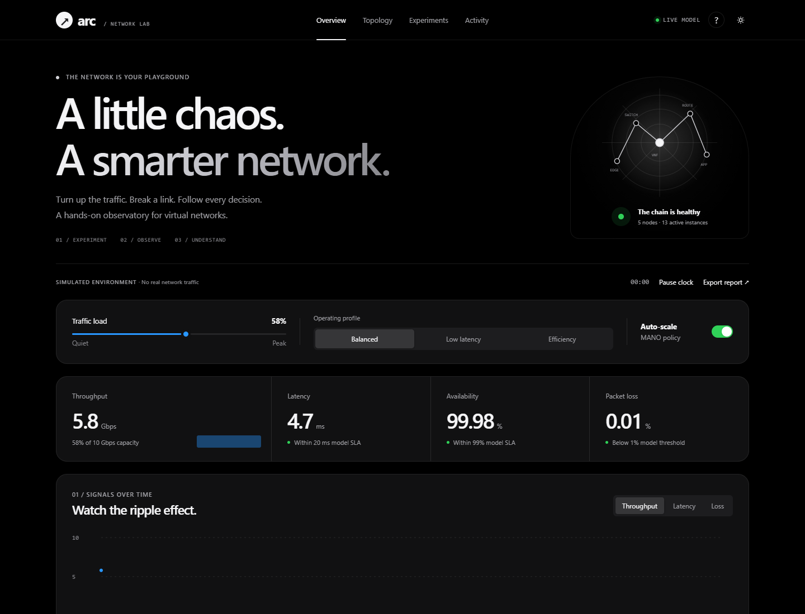
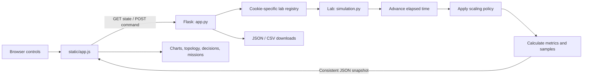
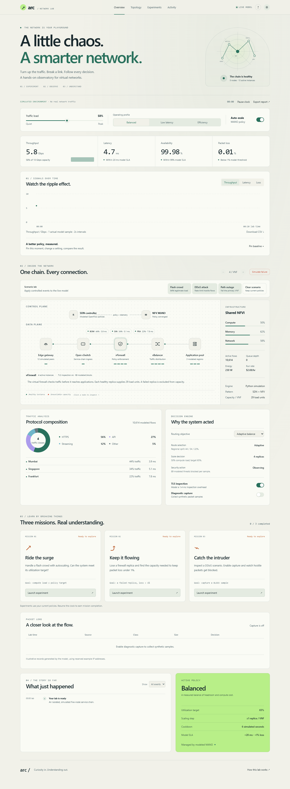
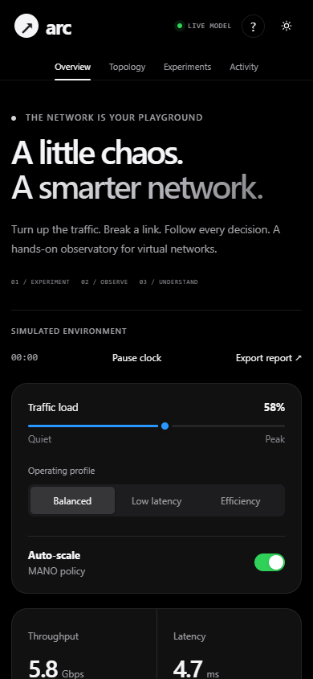

# Arc / Network Observatory

**An interactive NFV and SDN simulation lab for exploring traffic, virtual network functions, autoscaling, failures, and security policies.**

Arc turns a network architecture diagram into a working experiment. Increase demand, remove capacity, change routing, or inject a simulated attack, then follow the effect on throughput, latency, packet loss, resource usage, and cost.

Built with **Python, Flask, HTML, CSS, vanilla JavaScript, and SVG**. The application runs locally without an npm build, database, cloud account, or external asset CDN.

> **Simulation scope:** Arc is an educational model. Its packets, infrastructure, telemetry, prices, threat counts, and regional behavior are synthetic. It does not launch real network appliances, decrypt TLS, or generate attacks.



## Contents

- [Overview](#overview)
- [Features](#features)
- [Technologies](#technologies)
- [Installation and startup](#installation-and-startup)
- [Using the lab](#using-the-lab)
- [Architecture](#architecture)
- [Network components](#network-components)
- [Repository structure](#repository-structure)
- [State and sessions](#state-and-sessions)
- [Simulation model](#simulation-model)
- [Profiles and routing](#profiles-and-routing)
- [Scenarios and missions](#scenarios-and-missions)
- [Diagnostics and exports](#diagnostics-and-exports)
- [API reference](#api-reference)
- [Function reference](#function-reference)
- [Frontend behavior](#frontend-behavior)
- [Design and accessibility](#design-and-accessibility)
- [Testing](#testing)
- [Configuration](#configuration)
- [Troubleshooting](#troubleshooting)
- [Demonstration walkthrough](#demonstration-walkthrough)
- [Limitations and future improvements](#limitations-and-future-improvements)
- [Documentation and contribution](#documentation-and-contribution)
- [License](#license)

## Overview

Traditional network functions often run on dedicated appliances. **Network Function Virtualization (NFV)** represents those functions as software services, while **Software-Defined Networking (SDN)** separates forwarding from control decisions.

Arc models a five-node service chain:

```text
Clients → Edge gateway → Open vSwitch → vFirewall → vBalancer → Application pool
```

Its management and orchestration logic decides how much capacity to provision. The interface exposes the relationship between a user's policy choices and the resulting service behavior.

The project is useful for learning computer networking, demonstrating NFV concepts, comparing simplified operating policies, and explaining cause and effect during a project presentation.

### Questions you can explore

- What happens when demand exceeds healthy firewall capacity?
- How does autoscaling respond to a traffic surge?
- Can a service continue after one replica fails?
- How do latency-first and cost-first routing differ?
- How does inspection overhead affect response time?
- What changes when automatic scaling is disabled?

## Features

| Feature | What you can do |
| --- | --- |
| Live topology | Follow traffic through five nodes and inspect each component's role. |
| Traffic control | Set legitimate ingress demand from 10% to 100% of a modeled 10 Gbps line. |
| Operating profiles | Select Balanced, Low latency, or Efficiency policies. |
| Automatic scaling | Observe one-replica adjustments with a six-second simulated cooldown. |
| Manual capacity | Disable autoscaling and provision one to five replicas per VNF. |
| Failure injection | Make one firewall replica unavailable, then restore it. |
| Scenario lab | Apply flash-crowd, DDoS, and primary-path outage scenarios. |
| Performance history | Inspect actual model samples for throughput, latency, and packet loss. |
| Baseline comparison | Pin a snapshot and compare performance and modeled hourly cost after changes. |
| Regional routing | Compare Mumbai, Singapore, and Frankfurt traffic distribution. |
| Guided missions | Complete three experiments using model-verified success conditions. |
| Packet lens | View retained synthetic PASS, BLOCK, and DROP diagnostic records. |
| Event timeline | Filter incidents, scaling decisions, and policy changes. |
| Playback | Pause/resume the simulation clock without losing the current configuration. |
| Downloads | Export a complete JSON report or numeric telemetry as CSV. |
| Connection recovery | See connection state and automatically retry an unavailable backend. |
| Appearance | Use an Apple-inspired black/graphite dark theme or a light theme. |
| Accessibility | Navigate with a keyboard, inspect labeled controls, and use reduced-motion support. |

## Technologies

| Technology | Role |
| --- | --- |
| Python 3.10+ | Simulation engine, state, formulas, concurrency, and report generation. |
| Flask 3.1.2 | Local web server, JSON API, cookie sessions, and static-file delivery. |
| Jinja | Renders the application template and resolves local asset URLs. |
| HTML5 | Semantic sections, controls, diagnostic table, and native guide dialog. |
| CSS | Theme variables, responsive layouts, focus states, and flow animation. |
| Vanilla JavaScript | API calls, polling, DOM rendering, comparisons, and UI events. |
| SVG | Telemetry plots, topology icons, radar illustration, and favicon. |
| Python standard library | Dataclasses, bounded deques, locks, monotonic clock, math, CSV, and tests. |
| unittest | Backend regression testing without a separate test dependency. |
| Playwright, optional | Headless browser checks, downloads, interaction verification, and screenshots. |

The runtime dependency is declared in [requirements.txt](requirements.txt). Optional browser-testing dependencies are in [requirements-dev.txt](requirements-dev.txt).

**Node.js is optional** and is only used for the JavaScript syntax-check command. It is not needed to start or use Arc.

## Installation and startup

### Prerequisites

- Python 3.10 or later; development verification used Python 3.13.
- A modern browser with JavaScript and cookies enabled.
- Git if you want to clone the repository.

### Clone the repository

```bash
git clone https://github.com/devatmanpal17/networkfunctionvisualiser.git
cd networkfunctionvisualiser
```

### Windows PowerShell

```powershell
python -m venv .venv
.\.venv\Scripts\python.exe -m pip install -r requirements.txt
.\.venv\Scripts\python.exe app.py
```

### macOS or Linux

```bash
python3 -m venv .venv
./.venv/bin/python -m pip install -r requirements.txt
./.venv/bin/python app.py
```

Open **[http://127.0.0.1:8765](http://127.0.0.1:8765)** and keep the server process running. Stop it with **Ctrl+C**.

Using the virtual environment's Python directly avoids needing to activate it.

### Which HTML file should I open?

The root [index.html](index.html) is a launcher containing startup instructions and documentation links. The live application is rendered by Flask from [templates/index.html](templates/index.html).

Opening the template directly as a file does not start Python or resolve its Jinja expressions. Use the localhost URL for the interactive lab.

### Use another port

If 8765 is occupied, use the virtual environment's Python:

```powershell
.\.venv\Scripts\python.exe -m flask --app app run --host 127.0.0.1 --port 8766
```

On macOS/Linux, replace the executable with ./.venv/bin/python. Then open http://127.0.0.1:8766. The frontend's relative API URLs follow the port serving the application.

## Using the lab

1. **Inspect the baseline.** Start with Balanced mode and look at the current metrics.
2. **Pin a baseline.** Save the current state for a before/after comparison.
3. **Change demand or policy.** Adjust traffic, select a profile, or change routing.
4. **Launch an experiment.** Try a scenario or one of the learning missions.
5. **Follow the response.** Watch the chart, healthy replicas, resource meters, and decision engine.
6. **Inspect diagnostics.** Enable capture to collect synthetic packet records.
7. **Pause and export.** Freeze the clock to discuss results, then download JSON or CSV.

The **?** button opens a field guide with a short walkthrough and networking glossary. Navigation buttons scroll to Overview, Topology, Experiments, and Activity.

## Architecture



### Request lifecycle

1. Flask serves the HTML template and local assets.
2. JavaScript requests /api/state.
3. Flask uses the signed session cookie to retrieve or create a Lab.
4. The simulator advances elapsed time and creates a locked, consistent snapshot.
5. The browser renders every panel from that snapshot.
6. A user action sends a JSON POST command.
7. Flask validates keys, types, and allowed values before applying the command.
8. The command changes state, records an event, increments a revision, and returns updated data.
9. Polling continues to show subsequent scaling and diagnostic samples.

The server owns simulation behavior. The browser handles presentation, selected views, and baseline comparisons.

## Network components

| Component | Networking concept | What Arc models |
| --- | --- | --- |
| Edge gateway | Traffic ingress | Legitimate demand from modeled clients. |
| Open vSwitch | Software forwarding plane | A node representing service-chain forwarding. |
| vFirewall | Security VNF | Healthy capacity, inspection overhead, threat estimates, and diagnostic decisions. |
| vBalancer | Traffic-distribution VNF | Provisioned replicas and selected regional routing weights. |
| Application pool | Service destinations | Three regions with fixed latency multipliers. |
| SDN controller | Control plane | Routing objectives and forwarding-policy explanations. |
| NFV MANO | Management and orchestration | Replica targets, automatic scaling, and cooldown enforcement. |
| NFVI | Shared infrastructure | Derived compute, memory, network, energy, and cost quantities. |

A configured replica can be unavailable while other replicas continue serving traffic. Instance bars show healthy firewall capacity; the provisioned pool size is shown separately.

## Repository structure

```text
networkfunctionvisualiser/
├── app.py                         Flask application and HTTP API
├── simulation.py                  Deterministic simulation engine
├── README.md                      Main project documentation
├── requirements.txt               Runtime dependency
├── requirements-dev.txt           Optional browser-testing dependencies
├── index.html                     Local launcher
├── templates/
│   └── index.html                 Canonical application template
├── static/
│   ├── app.js                     Frontend logic and interactions
│   ├── styles.css                 Base component styles
│   ├── observatory.css            Themes, new panels, and responsive overrides
│   └── favicon.svg                Vector brand icon
├── docs/
│   ├── PROJECT_GUIDE.md           Extended architecture and model explanation
│   └── FUNCTION_REFERENCE.md      Detailed function and event-handler reference
├── tests/
│   ├── test_lab.py                Backend behavioral tests
│   └── browser_smoke.py           Optional browser workflow verification
└── output/
    ├── previews/                  Desktop, tablet, and mobile screenshots
    ├── legacy-nfv-visualization.html  Preserved original root visualization
    ├── nfv-lab-visualization.html  Earlier standalone artifact
    └── running-model/index.html   Earlier standalone artifact
```

Flask uses app.py, simulation.py, templates/, and static/. The earlier output HTML artifacts are preserved references and are not loaded by the live application.

## State and sessions

### Default configuration

| State field | Default | Meaning |
| --- | --- | --- |
| traffic | 58 | Legitimate load as a percentage of the 10 Gbps line. |
| autoscale | true | Automatic replica management enabled. |
| firewall_failed | false | Whether one firewall replica is unavailable. |
| profile | balanced | Active operating profile. |
| firewall_replicas | 4 | Configured firewall pool size. |
| balancer_replicas | 4 | Configured load-balancer pool size. |
| policy_target | 65 | Target compute utilization percentage. |
| routing_mode | adaptive | Regional routing objective. |
| encryption | true | Historical API key for modeled TLS inspection. |
| ddos_active | false | Residual attack load enabled. |
| capture_enabled | false | Synthetic diagnostic sampling enabled. |
| paused | false | Whether simulation ticks are frozen. |
| scenario | baseline | Current scenario label. |
| tick | 0 | Number of completed two-second simulation intervals. |

### Ownership and retention

- Tabs sharing a browser session cookie share one lab.
- A separate private browser context or profile receives an independent lab.
- The server stores at most **128 labs** and evicts inactive labs after **six hours**, checked on registry access.
- Each lab retains **90 telemetry samples**, **80 events**, and **32 diagnostic packet records**.
- Server state is held in memory and clears on restart.
- Theme preference uses browser localStorage.
- The pinned baseline lives in the current page's memory and clears on reload.
- Mission completion remains in the lab session until the lab is replaced or the server restarts.

A registry lock protects session creation/eviction. Each Lab uses an RLock to protect commands and snapshots. A separate lab identity lets the frontend detect a fresh simulator after restart or eviction.

## Simulation model

Arc uses understandable, deterministic heuristics. These values are suitable for illustrating relationships, not predicting a real deployment.

### Time and sampling

The model uses time.monotonic() and a **two-second sample interval**. It advances when a state request, command, or export accesses the lab.

For each elapsed interval, it increments the tick, runs scaling, stores metrics, optionally records a packet, and evaluates mission completion. Repeated reads within one interval create no extra ticks.

Pause freezes automatic scaling, packet sampling, history advancement, and mission evaluation. You can still change settings while paused. Resume resets the sampling reference so paused wall time is not replayed.

After a long idle interval, the model computes at most the latest 90 steps and skips older ticks. This bounds request work; scaling evolution in the skipped interval is not reconstructed.

A command refreshes the latest history point at the current lab time. Multiple commands within a tick therefore share that point, while separate timeline events record each action.

### Demand and healthy capacity

Let:

- T = legitimate traffic value.
- D = effective demand.
- H = healthy firewall replicas.
- C = healthy service-chain capacity.
- P = overload pressure.

```text
D = T + 16 during DDoS; otherwise T
H = max(0, configured firewall replicas − failed replica count)
C = min(H, balancer replicas) × 29
P = max(0, D − C)
```

The added attack demand represents residual hostile load after conceptual rate limiting. A failed firewall is excluded from capacity.

### Autoscaling

```text
base desired replicas = clamp(ceil(D / (29 × policy_target / 100)), 1, 5)
desired replicas      = min(5, base desired replicas + failed replica count)
```

Automatic scaling changes both configured VNF pools by **one replica per adjustment**, with at least **six simulated seconds** between adjustments. The first change can occur on the next sample.

For Balanced mode at 58% load:

```text
ceil(58 / (29 × 0.65)) = ceil(3.077...) = 4 replicas
```

At 94% load, five replicas are required. The hard maximum means some strict utilization targets cannot be achieved.

### Packet loss, throughput, and availability

```text
loss (%) = 100 when C = 0
           min(100, 0.01 + 100 × P / D) otherwise

throughput (Gbps) = min(10, T × 0.1 × (1 − loss / 100))
availability (%) = max(0, 99.99 − loss)
```

No healthy firewall capacity produces **zero throughput, 100% loss, and zero modeled availability**.

Availability is a loss-derived proxy, not a measured uptime percentage.

### Latency

```text
base latency = 2.2 + 0.032 × D + 0.18 × P + failure penalty

latency = base latency × routing factor
          + TLS inspection overhead
          + attack overhead
          + deterministic variation
```

| Term | Value |
| --- | --- |
| Failure penalty | 1.2 ms when a replica is failed. |
| TLS inspection overhead | 1.4 ms when inspection is enabled. |
| Attack overhead | 0.7 ms during DDoS. |
| Deterministic variation | 0.12 × sin(tick / 3.2). |
| p95 estimate | Latency × 1.42. |

The p95 field is a heuristic estimate, not a percentile computed from observed packets. The latency value remains an estimate even when no requests are delivered.

### Other telemetry

| Metric | Derivation |
| --- | --- |
| CPU | min(100, round(100 × D / max(C, 1))). |
| Memory | min(100, round(23 + 8 × configured firewall replicas + 0.12 × D)). |
| Network | min(100, round(D)). |
| Active flows | round(183 × D). |
| Queue depth | round(8.4 × P). |
| Energy | round(72 + 1.2 × D + 11 × total configured VNF replicas), in modeled watts. |
| Blocked threats | round(48 + 0.7 × T + 740 during DDoS), if healthy firewall capacity exists; zero otherwise. |

Threat counts are per-sample estimates, not cumulative totals. CPU/network meters saturate at 100%; packet loss and queues expose additional pressure.

### Modeled cost

```text
compute cost ($/hr) = 0.19 × total configured VNF replicas + 0.46
egress cost ($/hr)  = T × 0.1 × sum(regional share × regional price)
hourly cost ($/hr)  = compute cost + egress cost
```

Regional shares are fractions in this calculation. Fictional prices are $0.16, $0.12, and $0.05 per Gbps-hour for Mumbai, Singapore, and Frankfurt.

Provisioned replicas still contribute cost if a replica fails. Egress estimates use offered legitimate demand. The model's numbers are not cloud-provider prices or billing measurements.

### SLA and health indicators

| Target | Passing condition |
| --- | --- |
| Latency | Below 20 ms. |
| Packet loss | Below 1%. |
| Modeled availability | At least 99%. |

Overall status is offline if no healthy firewall exists. Otherwise it is degraded during failure/DDoS, at loss ≥1%, or at latency ≥20 ms; otherwise healthy. An active incident can therefore show degraded status while individual SLA targets still pass.

## Profiles and routing

### Operating profiles

| Profile | Baseline traffic | Utilization target | Purpose |
| --- | --- | --- | --- |
| Balanced | 58% | 65% | Balance capacity headroom and compute cost. |
| Low latency | 42% | 52% | Provision more headroom for responsiveness. |
| Efficiency | 66% | 78% | Favor higher utilization with fewer instances. |

Applying a profile changes traffic and target. It preserves routing, autoscaling choice, capture, inspection, and existing incident flags.

### Routing objectives

| Mode | Mumbai share | Singapore share | Frankfurt share | Latency factor |
| --- | --- | --- | --- | --- |
| Adaptive | 44% | 34% | 22% | 0.82 |
| Lowest latency | 65% | 25% | 10% | 0.72 |
| Lowest cost | 25% | 25% | 50% | 1.08 |

Displayed regional latency is chain latency multiplied by 0.82, 1.08, and 1.65 respectively.

These preset weights create a visible latency/cost trade-off. They do not represent a live geographic optimizer or measured internet routes.

## Scenarios and missions

### Scenario controls

| Scenario | Effect |
| --- | --- |
| Flash crowd | Sets legitimate traffic to 94% and clears attack/failure flags. |
| DDoS attack | Sets traffic to 86%, enables residual attack demand, and clears replica failure. |
| Path outage | Fails one firewall replica, clears the attack flag, and uses the current profile's baseline traffic. |
| Clear scenario | Clears attack/failure, restores profile baseline traffic, and keeps current policies/capacity. |

Selecting a new scenario replaces the previous scenario's incident flags. The separate failure button can independently toggle a failure and combine it with another scenario.

### Learning missions

| Mission | Goal checked on a simulation sample |
| --- | --- |
| Ride the surge | Flash scenario active, autoscaling enabled, and displayed compute utilization at or below target. |
| Keep it flowing | Path-outage scenario active, one replica still unavailable, and packet loss below 1%. |
| Catch the intruder | DDoS active, capture enabled, and a retained BLOCK diagnostic sample exists. |

Mission launch resumes the clock and enables autoscaling if needed. It preserves the current profile, routing, inspection, and capture choices.

The security mission leaves enabling capture to the learner. Completed mission IDs are retained for the session.

**Capacity experiment:** With Low latency's 52% target and a 94% surge, the five-replica maximum is insufficient to meet the target. Switch profile or reduce demand to study the trade-off and complete the mission.

## Diagnostics and exports

### Packet lens

Capture creates one illustrative record on each sample while enabled:

- Source addresses are generated from the documentation range 192.0.2.x.
- Classes cycle through HTTPS, API, HTTPS, and Streaming.
- Sizes are deterministic illustrative byte counts.
- Every third attack tick produces BLOCK when healthy capacity exists.
- No healthy firewall produces DROP.
- Other diagnostic records produce PASS.

The engine retains 32 records and the interface shows the latest six. Disabling capture preserves existing records. This is synthetic diagnostic sampling, not a PCAP capture or a statistical representation of real traffic.

Traffic composition is also preset: normal traffic uses HTTPS/API/Streaming/Other shares of 56/27/12/5%; DDoS uses HTTPS/API/Streaming/Hostile shares of 36/17/7/40%.

### Download formats

| Download | Contents | Filename |
| --- | --- | --- |
| JSON report | Current state, metrics, history, events, retained packets, decisions, regions, missions, and report metadata. | arc-lab-report.json |
| CSV telemetry | All retained numeric history rows, including elapsed time and metric fields. | arc-telemetry.csv |

The baseline comparison is browser-local and is not included in the server's JSON report. Export before stopping the server if you want to retain session results.

## API reference

All POST commands require **Content-Type: application/json** and a JSON object. They accept exact keys and types; strings are not converted to booleans or integers.

### Endpoints

| Method | Endpoint | Accepted input |
| --- | --- | --- |
| GET | / | Application page. |
| GET | /api/state | Full current lab snapshot. |
| POST | /api/traffic | {"value": 94}; integer from 10 to 100. |
| POST | /api/autoscale | {"enabled": true}; boolean. |
| POST | /api/profile | {"profile": "balanced"}; balanced, latency, or efficiency. |
| POST | /api/failure | {}; toggles one replica's availability. |
| POST | /api/replicas | {"delta": -1}; exactly -1 or 1, with autoscaling disabled. |
| POST | /api/routing | {"mode": "adaptive"}; adaptive, latency, or cost. |
| POST | /api/security | {"encryption": true, "capture": false}; either or both boolean fields. |
| POST | /api/scenario | {"scenario": "flash"}; flash, ddos, link, or reset. |
| POST | /api/playback | {"paused": true}; boolean. |
| GET | /api/export?format=json | Download complete report; JSON is also the default. |
| GET | /api/export?format=csv | Download telemetry history. |

The historical encryption key means **modeled TLS inspection**, not a real transport-encryption setting.

Each successful command returns the updated full snapshot. Keep cookies between calls to operate on the same lab.

### PowerShell example with a shared session

```powershell
$labSession = New-Object Microsoft.PowerShell.Commands.WebRequestSession

# Initialize an independent cookie-backed lab.
Invoke-RestMethod -Uri "http://127.0.0.1:8765/api/state" -WebSession $labSession

# Apply a flash-crowd scenario to that same lab.
$scenarioBody = @{ scenario = "flash" } | ConvertTo-Json
Invoke-RestMethod -Uri "http://127.0.0.1:8765/api/scenario" -Method Post -ContentType "application/json" -Body $scenarioBody -WebSession $labSession

# Inspect its resulting metrics.
$snapshot = Invoke-RestMethod -Uri "http://127.0.0.1:8765/api/state" -WebSession $labSession
$snapshot.metrics
```

This terminal session has its own cookie-backed lab, separate from a browser that has not shared its cookies.

### Error responses

| HTTP status | Cause |
| --- | --- |
| 400 | Invalid JSON, non-object body, wrong keys/types/ranges, or unsupported export format. |
| 404 | Unknown command. |
| 409 | Manual replica change attempted while autoscaling is enabled. |
| 413 | Request body exceeds 4 KiB. |

Example:

```json
{
  "error": "Disable autoscaling before changing replicas."
}
```

## Function reference

The tables below cover the runtime's named functions. For implementation walkthroughs, all UI callbacks, and individual test functions, see [FUNCTION_REFERENCE.md](docs/FUNCTION_REFERENCE.md).

### Simulation functions

| Function | Responsibility |
| --- | --- |
| desired_replicas(traffic, target) | Calculates the utilization-based replica target, clamped to 1–5. |
| Lab.__init__(clock) | Creates state, clock references, locks, bounded stores, identity, and initial sample. |
| Lab.record(kind, title, detail) | Adds a UTC/lab-time event to the timeline. |
| Lab.demand() | Returns legitimate traffic plus residual attack pressure. |
| Lab.scale() | Moves capacity toward the target while respecting manual mode and cooldown. |
| Lab.metrics() | Derives all numerical telemetry and the cost breakdown. |
| Lab.sample() | Stores metrics, generates optional diagnostics, and evaluates missions. |
| Lab.advance() | Converts elapsed monotonic time into bounded simulation steps. |
| Lab.snapshot() | Returns a locked, consistent payload for the dashboard. |
| Lab.apply(action, data) | Atomically applies a validated command, records it, and returns new state. |

LabState is a dataclass containing configuration and incident state. Its initializer and representation methods are generated by Python.

### Flask functions

| Function | Responsibility |
| --- | --- |
| create_app(test_config) | Creates Flask, its configuration, private lab registry, and routes. |
| get_lab() | Retrieves/creates the cookie-specific lab and enforces registry retention. |
| json_body() | Reads JSON and rejects malformed or non-object input. |
| validate(action, data) | Checks exact command keys, types, ranges, and choices. |
| index() | Renders the canonical application template. |
| get_state() | Returns the requesting session's current snapshot. |
| command(action) | Dispatches validated POST actions and returns JSON errors. |
| export_report() | Builds downloadable JSON or CSV responses. |
| response_headers(response) | Sets API cache policy and basic browser response protections. |
| too_large(error) | Returns a JSON error for oversized request bodies. |

Route/helper functions are nested inside create_app(), keeping each application instance's registry independent.

### JavaScript functions

| Function | Responsibility |
| --- | --- |
| $(selector), $$(selector) | Select one DOM element or an array of matching elements. |
| escapeHtml(value) | Escapes text before interpolation into generated markup. |
| setText(id, value) | Updates textContent only when the value changes. |
| formatTime(seconds) | Formats elapsed lab duration as minutes:seconds. |
| storageGet(key), storageSet(key, value) | Read/write theme preference while tolerating unavailable storage. |
| api(path, body) | Sends timed GET/JSON POST requests and handles JSON/HTTP failures. |
| syncControls() | Applies connection, command, debounce, and replica-limit control states. |
| setConnection(value) | Updates the live/paused/reconnecting indicator and controls. |
| renderTopology(nodes) | Builds node cards, caches unchanged renders, and restores node focus. |
| renderSelectedNode() | Displays selected-node details and its networking explanation. |
| renderRegions(regions) | Updates regional traffic and latency chips/table. |
| renderAnalysis(state) | Renders composition, decisions, policy controls, and infrastructure details. |
| renderEvents() | Applies event filtering and displays the latest matching events. |
| renderChart() | Builds responsive SVG history/thresholds and actual throughput bars. |
| renderComparison() | Calculates and displays baseline-to-current metric differences. |
| renderPackets(state) | Displays capture state and retained diagnostic records. |
| renderMissions(state) | Shows server-confirmed mission progress and new completion notifications. |
| render(state) | Rejects stale data, updates current state, and coordinates all panels. |
| showToast(message) | Displays a text notification for four seconds. |
| update(path, body, message) | Serializes mutations, renders results, and handles command errors. |
| poll() | Refreshes visible-page telemetry and schedules bounded retry backoff. |
| launchMission(id) | Resumes/enables scaling as needed and applies the mission scenario. |
| openGuide() | Opens the native modal field guide. |
| bindEvents() | Registers controls, delegated topology clicks, and page lifecycle callbacks. |
| initialise() | Restores appearance, binds events, and starts polling. |

## Frontend behavior

The client stores the accepted snapshot, selected node/metric, optional baseline, connection state, timers, and a promise-based command queue.

- **Polling:** Normal refresh delay is approximately two seconds after request completion. Polls skip hidden pages and periods with pending commands.
- **Timeouts:** Requests time out after eight seconds. Poll failures increase the retry delay up to ten seconds.
- **Mutation ordering:** A promise queue executes commands in order and temporarily disables conflicting controls.
- **Slider debounce:** Traffic previews immediately; a command is sent after 180 ms without another input. The slider remains responsive during that interval.
- **Stale responses:** Older revisions or older same-revision elapsed times are ignored.
- **Fresh sessions:** A changed lab identity resets old client comparisons and mission-render tracking.
- **Efficient topology:** Unchanged nodes do not recreate buttons or restart flow animations.
- **Safe text rendering:** Plain text uses textContent; interpolated server strings are escaped where appropriate.
- **Lifecycle:** Returning to a visible page refreshes state; page hiding/navigation stops appropriate timers.

The charts do not invent browser-side random telemetry. Their values come from server history; the browser only calculates plot geometry.

## Design and accessibility

Dark mode uses true black backgrounds, graphite surfaces, silver headline typography, subtle borders, and selective blue interaction accents. Green/red/amber communicate health and incidents.

Light mode uses a warm neutral background and coordinated controls. All decorative artwork is local SVG or CSS.

The layout adapts from desktop cards and a horizontal chain to narrow mobile controls and a vertical topology. It includes:

- Keyboard-operable buttons and form controls.
- A skip link and visible focus indicators.
- Accessible labels and pressed states for selectable controls.
- Connection/toast announcements.
- A native modal guide with Escape support.
- Text descriptions accompanying the SVG chart.
- Reduced-motion support that disables animation and smooth scrolling.
- A horizontally scrollable diagnostic table inside its panel.

<details>
<summary>View additional screenshots</summary>

**Light theme**



**Mobile dark theme**



More views are available in [output/previews](output/previews).

</details>

## Testing

### Backend checks

From the project directory:

```powershell
.\.venv\Scripts\python.exe -m unittest discover -s tests -v
```

On macOS/Linux, use ./.venv/bin/python.

The suite contains **22 behavioral tests**, covering clock/history, scaling cooldowns, complete outage/recovery, pause, capture retention, scenario changes, missions, overload, routing/cost/inspection, bounded memory, concurrent commands, validation, cookie isolation, exports, and registry limits.

### Optional JavaScript syntax check

If Node.js is installed:

```bash
node --check static/app.js
```

### Browser workflow check

```powershell
.\.venv\Scripts\python.exe -m pip install -r requirements-dev.txt
.\.venv\Scripts\python.exe tests/browser_smoke.py
```

On Windows, the script selects an installed Chrome or Edge from the standard paths. It uses an isolated headless profile, not your normal browser session.

Otherwise install Playwright Chromium:

```powershell
.\.venv\Scripts\python.exe -m playwright install chromium
```

You can also set ARC_BROWSER_EXECUTABLE to a local Chromium executable. On macOS/Linux, replace the Python executable in these commands.

The test starts a disposable app on **port 8770**, verifies interactions and downloads, saves previews, and shuts down the test server. It covers mission completion, capture, manual capacity, full outage, chart/event selection, guide, themes, persistence, narrow layouts, independent sessions, and connection recovery.

The existing backend suite and browser flows were verified during development. Screenshots document representative rendered states.

## Configuration

| Setting | Default / location | Purpose |
| --- | --- | --- |
| App host | 127.0.0.1 in app.py | Binds the development server to loopback. |
| App port | 8765 in app.py | Local application URL. |
| Debug | false in app.py | Runs without the debug reloader. |
| ARC_SECRET_KEY | Random key if unset | Optional environment-provided cookie-signing key. |
| MAX_CONTENT_LENGTH | 4096 bytes | Command body-size limit. |
| SAMPLE_SECONDS | 2 in simulation.py | Model sampling interval. |
| COOLDOWN_SECONDS | 6 in simulation.py | Time between automatic capacity adjustments. |
| REPLICA_CAPACITY | 29 in simulation.py | Capacity per healthy replica. |
| PROFILES / ROUTES | simulation.py | Operating presets and regional weights. |
| ARC_BROWSER_EXECUTABLE | Optional environment variable | Browser executable for the optional smoke test. |

The application does not load a .env file automatically. Set environment variables in the process environment when needed. A fixed signing key does not make the in-memory lab registry persistent.

## Troubleshooting

| Symptom | What to check |
| --- | --- |
| Python command is unavailable | Install Python or use the platform's available python3/py executable. |
| No module named flask | Install requirements using the same virtual-environment Python that starts the app. |
| Localhost cannot connect | Keep app.py running and use the port shown in its startup output. |
| Template opens with unresolved braces | Open the Flask URL instead of opening templates/index.html as a file. |
| Port 8765 is occupied | Stop an earlier lab process or run on port 8766 using the alternate command. |
| Replica buttons are disabled | Disable autoscaling; check the one-to-five limits and connection state. |
| History/capture is not advancing | Resume the clock and enable capture if needed; wait for a complete sample interval. |
| Reconnecting is shown | Restart/reach the local backend; the client retries automatically. |
| Mission does not complete | Check its exact condition, active scenario, clock state, and target feasibility under five replicas. |
| Progress disappears after restart | Sessions are intentionally in memory; export reports before stopping. |
| Style/template change is not visible | Refresh the browser; after template edits, restart Flask if its template cache is still active. |
| Browser test cannot find Chromium | Install Playwright Chromium or set ARC_BROWSER_EXECUTABLE. |
| Browser test cannot bind port 8770 | Stop another test server using that port before running it again. |

## Demonstration walkthrough

For a classroom or project presentation:

1. Start the Balanced baseline and explain the five-node chain.
2. Pin a baseline, then launch **Ride the surge**.
3. Point out increased demand, the desired replica count, capacity adjustment, and its cost.
4. Launch **Keep it flowing** and distinguish configured replicas from healthy replicas.
5. Disable autoscaling and reduce capacity to show overload, queues, and packet loss.
6. With one configured firewall, inject failure and show zero delivered throughput.
7. Restore capacity and automatic scaling.
8. Launch **Catch the intruder**, enable capture, and identify a BLOCK sample.
9. Compare latency-first and cost-first routing with the same load.
10. Pause, discuss the decisions/events, and export the report.

This sequence demonstrates cause and effect rather than treating synthetic metrics as real network measurements.

## Limitations and future improvements

### Current limits

- Educational heuristics rather than a calibrated network-performance model.
- No real Open vSwitch, Ryu, Docker, TLS decryption, DDoS traffic, or packet collector.
- Preset regional distributions and protocol mixes.
- Availability and p95 are proxies; threat/cost values are illustrative.
- A five-replica maximum and bounded rolling history.
- In-memory state without a database or cross-process shared registry.
- No authentication or production deployment configuration.
- A local Flask development server rather than a production service.

### Possible extensions

These are future ideas, not currently implemented features:

- Durable sessions and reports through a database or Redis.
- Configurable service-chain layouts and additional VNFs.
- Calibrated workload and scheduling models.
- Real monitoring inputs through Prometheus or OpenTelemetry.
- A separately managed Mininet/Ryu adapter.
- Longer experiment history and report comparisons.
- Shared classroom exercises with explicit user/session management.

## Documentation and contribution

- [PROJECT_GUIDE.md](docs/PROJECT_GUIDE.md) provides a longer walkthrough of the architecture, formulas, use cases, and model boundaries.
- [FUNCTION_REFERENCE.md](docs/FUNCTION_REFERENCE.md) explains every named function, every UI event handler, and individual tests.
- [Repository](https://github.com/devatmanpal17/networkfunctionvisualiser) contains the source and development history.

To extend the project, keep model behavior in simulation.py, HTTP/session concerns in app.py, and presentation in static/app.js and CSS.

Add meaningful behavioral checks when changing simulation/API behavior. For visual changes, inspect relevant desktop/mobile states; for documentation, verify commands and links against the repository. Update this README and the detailed references when behavior changes.

## License

The repository does not currently include a LICENSE file. No additional license is declared by this README.
