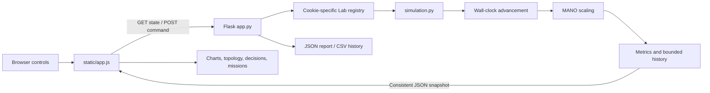

# Arc Network Observatory — complete project solution

## 1. What the project does

Arc is an interactive educational simulator for **Network Function Virtualization (NFV)** and **Software-Defined Networking (SDN)**. You change traffic demand and operating policies, inject controlled failures or an attack scenario, and observe how a virtual service chain responds.

The main problem it addresses is understanding the relationship between **load, capacity, security, performance, and cost**. Instead of reading a static architecture diagram, you can see the effect of changing one variable, pin a baseline, and compare results.

This is a Python simulation delivered through a web interface. It does not create real network traffic, run a production firewall, decrypt TLS, start Docker containers, install OpenFlow rules, or execute a real DDoS attack. References to those components explain the architecture being modeled. All telemetry, IP records, regional weights, prices, and threat counts are synthetic.

## 2. What was improved

| Area | Result |
| --- | --- |
| Visual design | An Apple-inspired black and graphite dark theme with silver typography, restrained blue controls, a network radar, and a coordinated light theme. |
| Responsive design | Desktop, tablet, and narrow mobile layouts; mobile navigation remains available. |
| Performance history | Actual server model samples replace randomly invented browser chart values. Switch between throughput, latency, and packet loss; view the SLA threshold. |
| Scientific comparison | Pin current metrics, change a policy, and see before/after throughput, latency, loss, and hourly cost. |
| Learning | Three missions have observable completion conditions and retained session progress. |
| Diagnostics | Capture now stores bounded synthetic packet records with PASS, BLOCK, and DROP decisions. |
| Time | Two-second wall-clock sampling, pause/resume, elapsed lab time, and bounded catch-up after inactivity. |
| Scaling | Utilization-based target calculation, one-replica steps, and a real six-second cooldown. |
| Capacity failure | No healthy firewall means zero throughput, 100% loss, and zero modeled availability. |
| Routing | Objectives change regional distribution, latency, and fictional egress cost. |
| Reliability | Cookie-isolated labs, bounded memory, serialized commands, stale-response checks, reconnect state, and automatic retries. |
| Input handling | Strict JSON objects, exact field types, range checking, command choices, and small body limits. |
| Transparency | Model labels, accurate policy text, node explanations, glossary, and honest infrastructure descriptions. |
| Export | JSON reports and CSV telemetry downloads. |
| Verification | 22 backend tests plus an optional real-browser end-to-end check. |

## 3. Technologies and why they are used

| Technology | Responsibility |
| --- | --- |
| Python 3.10+ | Simulation arithmetic, state management, concurrency primitives, and exports. The project was verified with Python 3.13. |
| Flask | Serves the page, local static assets, cookie sessions, and JSON endpoints. |
| Jinja templates | Generates correct local asset URLs in the application HTML. |
| HTML5 | Semantic page sections, native form controls, a diagnostic table, and a native modal dialog. |
| CSS | Responsive grids, theme variables, dotted topology surface, packet animation, and reduced-motion support. |
| Vanilla JavaScript | Fetch requests, DOM rendering, polling, event handlers, comparisons, and chart generation. |
| SVG | Resolution-independent icons, radar, favicon, and telemetry plots. |
| Python standard library | Dataclasses, bounded deques, math, UUIDs, locks, monotonic time, secrets, CSV, and tests. |
| unittest | Backend regression tests without another runtime dependency. |
| Playwright, optional | Exercises the real rendered UI in an isolated headless Chromium browser and creates screenshots. |

There is no npm build step, React runtime, external font dependency, chart CDN, database, or cloud account requirement. The runtime dependency is Flask and its installed dependencies. Browser testing dependencies are kept separately in requirements-dev.txt.

## 4. How to run it

From a PowerShell terminal inside this project:

```powershell
python -m venv .venv
.\.venv\Scripts\python.exe -m pip install -r requirements.txt
.\.venv\Scripts\python.exe app.py
```

Open **http://127.0.0.1:8765**. Keep the terminal process running while using the lab. Stop it with Ctrl+C.

The shorter commands also work in an environment where Flask is already installed:

```powershell
python -m pip install -r requirements.txt
python app.py
```

Opening the root index.html shows a launcher and documentation links. The interactive application is the Flask-served page from templates/index.html. Opening that template directly does not execute Jinja or start the API.

If port 8765 is already occupied, stop your earlier lab process, or use a different local port:

```powershell
python -m flask --app app run --host 127.0.0.1 --port 8766
```

Then open http://127.0.0.1:8766. Frontend API URLs are relative, so they follow that port.

## 5. Codebase map

```text
cn/
├── app.py                         Flask factory, session registry, API, export
├── simulation.py                  State, formulas, clock, scaling, missions
├── requirements.txt               Runtime dependency
├── requirements-dev.txt           Optional browser-test dependency
├── README.md                      Quick start and feature overview
├── index.html                     File-open launcher for the Python application
├── templates/
│   └── index.html                 Canonical application interface
├── static/
│   ├── app.js                     Client state, rendering, requests, events
│   ├── styles.css                 Base components and responsive foundation
│   ├── observatory.css            Observatory design, new panels, theme layer
│   └── favicon.svg                Local vector brand mark
├── docs/
│   ├── PROJECT_GUIDE.md           This detailed solution
│   └── FUNCTION_REFERENCE.md      Every named function and event handler
├── tests/
│   ├── test_lab.py                Backend model and API tests
│   └── browser_smoke.py           Optional browser flow and screenshot checks
└── output/
    ├── previews/                  Verified desktop, mobile, tablet screenshots
    ├── legacy-nfv-visualization.html  Preserved original root visualization
    ├── nfv-lab-visualization.html  Earlier standalone artifact
    └── running-model/index.html   Earlier standalone artifact
```

The earlier output artifacts are preserved references. Flask does not load them as application code.

## 6. Architecture and request lifecycle



1. Flask serves templates/index.html and the local CSS/JavaScript files.
2. JavaScript binds all UI event handlers and requests /api/state.
3. Flask reads the signed session cookie. A new browser session receives a new Lab.
4. Lab.snapshot() acquires a reentrant lock, advances any elapsed simulation time, and derives one consistent payload.
5. The browser renders all panels from that payload and polls again after approximately two seconds.
6. A user action sends a POST with a small JSON body. Flask validates it before touching the simulation.
7. Lab.apply() applies the command atomically, records an event, increments a revision, and returns a new snapshot.
8. The UI updates immediately. Future samples show the continuing scaling response.

The page is server-authoritative: the browser does not calculate infrastructure capacity, packet loss, mission success, or scaling decisions. It calculates presentation geometry and baseline deltas.

## 7. Components being modeled

The data plane is:

```text
Client demand → Edge gateway → Open vSwitch → vFirewall → vBalancer → Applications
```

| Component | Conceptual job | Implementation in this project |
| --- | --- | --- |
| Edge gateway | Receive ingress traffic | Traffic slider defines legitimate offered demand from modeled peers. |
| Open vSwitch | Forward through the service chain | A topology node representing the forwarding plane. No Open vSwitch process is launched. |
| vFirewall | Apply security policy | Healthy replica count supplies capacity; TLS inspection adds latency; attacks add residual demand and block samples. |
| vBalancer | Distribute requests | Replica count follows firewall capacity; routing objectives change modeled regional weights. |
| Application pool | Receive processed traffic | Three destinations with fixed latency multipliers. |
| SDN controller | Control forwarding policy | Represented by selectable routing objectives and explainable decisions. |
| NFV MANO | Manage virtual function capacity | Lab.scale() moves capacity toward the computed target with a cooldown. |
| NFVI | Supply shared infrastructure | CPU, memory, network, energy, and cost are derived from current state. |

One failed firewall replica can coexist with surviving healthy capacity. The firewall node shows a degraded status while its instance bars show the surviving pool. If all firewall capacity disappears, packet flow animation stops.

## 8. State and session ownership

LabState is the current configuration. Defaults are 58% traffic, Balanced profile, 65% utilization target, four configured replicas per VNF, adaptive routing, TLS inspection enabled, and no incident.

Other fields track autoscaling, firewall failure, attack activity, capture, pause state, current scenario, and tick count.

Each Lab also holds:

- A unique lab identity for detecting fresh server sessions.
- A monotonic clock and time of the last sample.
- The last scaling time, for cooldown enforcement.
- Up to 90 telemetry samples, 80 events, and 32 packet records.
- A mutation revision and a set of completed mission IDs.
- A reentrant lock protecting state and consistent snapshots.

Browser tabs sharing a cookie share the same lab. A separate browser profile or private context has its own lab. A registry lock protects creation and eviction of sessions. The registry retains at most 128 labs and evicts labs after six inactive hours when the registry is next accessed.

State is in memory. A server restart creates fresh sessions and clears telemetry and mission progress. Theme preference is saved in browser localStorage; baseline comparisons are held in the current page's memory and clear on reload. Download reports before stopping the server if you want to preserve findings.

## 9. Simulation clock and sampling

SAMPLE_SECONDS is 2. The model uses time.monotonic(), so system clock adjustments do not change elapsed lab time.

The model advances lazily when a state read, command, or export accesses it. It determines how many complete two-second periods have passed. For each period it:

1. Increments the tick.
2. Runs the scaling rule.
3. Stores metrics.
4. Generates a packet sample if capture is enabled.
5. Evaluates mission completion.

Repeated API reads during the same interval do not speed up the simulation or generate more history. On a long idle interval, the model skips older ticks and computes at most the latest 90 steps, bounding catch-up work. That tail is an educational approximation; scaling decisions in the skipped interval are not reconstructed.

Pause freezes ticks, automatic scaling, capture, and mission evaluation. Controls remain usable while paused so you can inspect the immediate effect of a configuration change. Resume resets the wall-time sampling reference, so time spent paused is never replayed.

Commands replace the most recent history point with the current metrics without adding a fictitious time step. Multiple changes in one interval therefore share the latest chart point; their separate events remain in the timeline.

## 10. Exact model equations

These are deliberately understandable heuristics, not calibrated performance predictions. A traffic value of 100 represents 10 Gbps of legitimate demand.

Let:

- T = traffic slider value, from 10 to 100.
- D = effective demand = T + 16 during DDoS, otherwise T.
- H = healthy firewalls = configured firewall replicas minus one if failure is active.
- C = available capacity = min(H, balancer replicas) × 29 load units.
- P = pressure = max(0, D − C).
- t = current tick.

### Capacity and scaling

```text
base desired replicas = clamp(ceil(D / (29 × target / 100)), 1, 5)
desired with failure  = min(5, base desired replicas + 1)
```

The extra replica compensates for unavailable firewall capacity. A step changes both VNF pools by one configured replica. The first adjustment can occur on the next two-second sample; later adjustments must be at least six simulated seconds apart. Autoscaling never exceeds five replicas, so a strict target may be unattainable.

For example, Balanced load 58 and target 65 requires ceil(58 / 18.85) = 4 replicas. A flash crowd at 94 requires five; utilization becomes approximately 65%, and the scaling mission completes.

### Loss and throughput

```text
loss (%) = 100, if C = 0
           min(100, 0.01 + 100 × P / D), otherwise
throughput (Gbps) = min(10, T × 0.1 × (1 − loss / 100))
availability (%) = max(0, 99.99 − loss)
```

Availability here is a loss-derived service-quality proxy, not an uptime measurement or historical reliability calculation.

If one replica is configured and it fails, H and C become zero. That guarantees 100% loss, zero throughput, zero modeled availability, and no modeled threat blocks. If one healthy replica handles T=100, capacity is 29 units, so substantial overload and loss appear.

### Latency

```text
base = 2.2 + 0.032 × D + 0.18 × P + (1.2 if a firewall failed)
latency = base × routing factor
          + (1.4 if TLS inspection enabled)
          + (0.7 if DDoS active)
          + 0.12 × sin(t / 3.2)
p95 latency = latency × 1.42
```

Routing factors are 0.82 for adaptive, 0.72 for latency-first, and 1.08 for cost-first. The sine term gives reproducible small variation rather than unrelated random chart noise. p95 is a heuristic multiplier, not a percentile calculated from packet timing observations. Latency remains an estimated model value even when the service is offline.

### Resources, flows, and diagnostic quantities

| Metric | Formula or meaning |
| --- | --- |
| CPU | min(100, round(100 × D / max(C, 1))) |
| Memory | min(100, round(23 + 8 × firewall replicas + 0.12 × D)) |
| Network | min(100, round(D)) |
| Active flows | round(183 × D) |
| Queue depth | round(8.4 × P) |
| Energy | round(72 + 1.2 × D + 11 × total configured VNF replicas), in fictional watts |
| Threats blocked | round(48 + 0.7 × T + 740 during DDoS) if healthy firewall capacity exists, otherwise zero; per-sample estimate, not cumulative total |

CPU and network meters saturate at 100%; queue and loss show overload beyond that meter limit.

### Regional routing and fictional cost

| Objective | Mumbai | Singapore | Frankfurt | Latency factor |
| --- | --- | --- | --- | --- |
| Adaptive | 44% | 34% | 22% | 0.82 |
| Lowest latency | 65% | 25% | 10% | 0.72 |
| Lowest cost | 25% | 25% | 50% | 1.08 |

Regional displayed latency is the chain estimate multiplied by 0.82, 1.08, and 1.65 respectively.

```text
compute cost = 0.19 × total configured VNF replicas + 0.46
egress cost  = T × 0.1 × sum(region share × region price)
hourly cost  = compute cost + egress cost
```

Region prices are fictional: $0.16, $0.12, and $0.05 per Gbps-hour for Mumbai, Singapore, and Frankfurt. Shares are fractions for this formula. This gives routing a visible cost/latency trade-off. Costs count provisioned instances even if a replica is failed and use offered legitimate demand for egress estimates. They are neither cloud provider quotes nor measured billing.

## 11. Profiles, scenarios, and missions

Profiles change traffic and target together:

| Profile | Baseline traffic | Target utilization |
| --- | --- | --- |
| Balanced | 58% | 65% |
| Low latency | 42% | 52% |
| Efficiency | 66% | 78% |

Profiles preserve routing, capture, autoscaling choice, and incident flags. Applying a profile during an incident lets you study the same incident with a different operating policy.

Each scenario replaces prior scenario incident flags:

| Scenario | Immediate state change |
| --- | --- |
| Flash crowd | Legitimate demand becomes 94%; attack and failure flags are cleared. |
| DDoS | Traffic becomes 86%; attack active; replica failure cleared. The model adds 16 residual load units after conceptual rate limiting. |
| Path outage | One firewall replica unavailable; attack cleared; traffic uses the current profile baseline. |
| Clear scenario | Attack/failure cleared and profile baseline traffic restored; current capacity and other policies are preserved. |

The failure button independently toggles one replica's availability. It can be combined with a scenario to make a more demanding experiment.

Mission launch resumes the clock if paused, enables autoscaling if disabled, and applies its scenario. It intentionally preserves profile, routing, and capture choices.

| Mission | Completion checked on a simulation sample |
| --- | --- |
| Ride the surge | Flash scenario active, autoscaling enabled, displayed compute utilization no greater than target. |
| Keep it flowing | Path outage scenario active, a replica still failed, packet loss below 1%. |
| Catch the intruder | DDoS scenario active, capture enabled, and a retained BLOCK diagnostic sample exists. |

Completion is retained for the session. Launching a completed mission again does not erase progress. With the Low latency profile, a 94% surge cannot meet a 52% target under the five-replica cap; switch to Balanced/Efficiency or reduce traffic to complete that experiment.

## 12. Diagnostic packet lens

Capture produces one illustrative row on each sample while enabled:

- Source addresses use the documentation range 192.0.2.x.
- Traffic class cycles through HTTPS, API, HTTPS, and Streaming.
- Size is a deterministic illustrative byte count.
- Every third tick during DDoS produces BLOCK if healthy capacity exists.
- No healthy firewall produces DROP.
- Other sampled records show PASS.

The engine retains 32 records. The UI shows the latest six, and the JSON report includes all retained records. Turning capture off stops new rows and preserves old rows. These samples illustrate policy decisions; they are not a PCAP file and are not statistically sampled real traffic.

## 13. API contract

All commands need Content-Type: application/json. Exact keys and types are required; numbers are not coerced from strings and strings such as "false" are not accepted as booleans.

| Method | Path | Body / purpose |
| --- | --- | --- |
| GET | / | Application HTML |
| GET | /api/state | Full state, metrics, history, decisions, events, packet samples, missions |
| POST | /api/traffic | {"value": 10..100}, integer |
| POST | /api/autoscale | {"enabled": true/false} |
| POST | /api/profile | {"profile": "balanced"/"latency"/"efficiency"} |
| POST | /api/failure | {} |
| POST | /api/replicas | {"delta": -1/1}, only with autoscaling disabled |
| POST | /api/routing | {"mode": "adaptive"/"latency"/"cost"} |
| POST | /api/security | {"encryption": boolean} and/or {"capture": boolean} |
| POST | /api/scenario | {"scenario": "flash"/"ddos"/"link"/"reset"} |
| POST | /api/playback | {"paused": true/false} |
| GET | /api/export?format=json | Download complete session report |
| GET | /api/export?format=csv | Download retained numeric telemetry history |

The historical field name encryption means modeled **TLS inspection**; toggling it does not actually change transport encryption. Every successful mutation returns the complete dashboard snapshot.

Invalid bodies/values return HTTP 400 with an error field. Manual scaling while autoscaling is enabled returns 409. Unknown commands return 404. Bodies over 4 KiB return 413. Unsupported export formats return 400.

The registry cookie must be kept between API calls if you want to operate on the same lab. Browser fetch does this automatically for same-origin requests.

## 14. Frontend operation and reliability

The client stores currentState, selected node, selected chart metric, optional baseline, connection state, timers, and a promise queue.

Mutations are queued in order. Controls are temporarily disabled during commands, avoiding conflicting rapid clicks. Traffic input is debounced by 180 ms; the slider stays responsive during the preview interval while other mutation controls wait for its committed value.

Polling uses a recursive timeout scheduled after request completion rather than overlapping interval requests. It skips hidden documents and periods with pending commands. An eight-second request timeout prevents indefinite waiting. Failed polls retry with a delay capped at ten seconds; a successful request restores the live indicator.

Revision and elapsed-time checks reject stale responses. A changed lab identity signals a fresh server session and resets client comparison/mission tracking. The server remains the source of truth.

The topology caches its render signature, so unchanged poll data does not recreate its buttons and restart animation. If a necessary re-render replaces a focused node, focus returns to the equivalent node. All server strings inserted into markup use escaping where appropriate; plain text uses textContent.

SVG chart coordinates come from the actual retained telemetry. Each metric gets its own labeled units and scale. The plotted line is accompanied by a textual accessible description.

## 15. Accessibility and presentation

The interface includes semantic sections, real buttons and labels, descriptive node names, pressed states, keyboard focus rings, a skip link, connection/toast announcements, and a native dialog that supports Escape.

The hidden checkbox controls show visible focus on their toggle. Reduced-motion preference disables animations and smooth scrolling. The topology becomes a vertical service chain on mobile, and wide diagnostic tables scroll inside their own container.

Themes use CSS variables. The second stylesheet extends the original reusable component foundation with the observatory identity and new panels. All art is CSS/SVG; the project has no generated raster asset requirement.

## 16. Testing and what was verified

Run backend checks:

```powershell
python -m unittest discover -s tests -v
node --check static/app.js
```

The 22 backend tests verify time-based history, cooldowns, zero-capacity failure, restoration, pause, capture retention, non-stacking scenarios, preserved policies, mission conditions, overload, routing and TLS effects, bounded memory, atomic concurrent commands, replica limits, assets/headers, session isolation, invalid requests, exports, and session registry size.

Run the optional browser check:

```powershell
python -m pip install -r requirements-dev.txt
python tests/browser_smoke.py
```

On Windows, the script uses an installed Chrome or Edge executable in a fresh headless profile. On another system, install Playwright Chromium with python -m playwright install chromium, or set ARC_BROWSER_EXECUTABLE to a local Chromium executable. The test serves an isolated test app on port 8770 and shuts it down when finished.

The browser flow verifies slider input, routing and inspection controls, node explanations, baseline pin/clear, all three missions, diagnostic BLOCK records, pause, manual scaling, complete outage/recovery, event filters, chart selection, guide dialog, JSON/CSV downloads, theme persistence, mobile/tablet overflow, cookie isolation, and network retry recovery.

Screenshots in output/previews cover desktop dark/light, mobile, tablet, and mobile guide states. They are evidence of UI rendering, not telemetry logs.

## 17. A useful demonstration for a project presentation

1. Open the Balanced baseline and pin it.
2. Launch Ride the surge. Point out that legitimate load increases, MANO adds capacity, and the comparison shows more throughput at a higher compute cost.
3. Launch Keep it flowing. Explain that the failed replica is removed from healthy capacity even though it remains provisioned.
4. Disable autoscaling and remove replicas. Watch packet loss rise as demand exceeds capacity.
5. Reach one configured firewall replica, then inject failure. Explain why throughput must become zero.
6. Restore the replica and re-enable autoscaling.
7. Launch Catch the intruder and enable diagnostic capture. Identify a BLOCK record and explain synthetic rate limiting.
8. Compare latency-first and cost-first routing with the same load. Discuss geographic weights and the modeled egress trade-off.
9. Pause to inspect the snapshot, export JSON/CSV, and use the event timeline to explain each change.

## 18. Limits and extension points

The current application is intended for local educational use. It has no authentication, durable database, multi-worker shared state, background network collector, or real infrastructure integrations. Its Flask development server binds to loopback and debug mode is off.

The numerical relationships are simplified and deterministic. Regional shares and traffic mix are presets; inspection adds a fixed overhead; the p95 and availability fields are proxies. Five replicas is a deliberate hard cap.

Useful future extensions include a Redis-backed session store, calibrated workload models, real Prometheus/OpenTelemetry inputs, multiple configurable service-chain layouts, durable experiment reports, and an adapter to a separately managed Mininet/Ryu test environment. Those should be separate changes with explicit integration requirements.

For maintenance, keep numerical behavior in simulation.py, HTTP concerns in app.py, and presentation in static/app.js and CSS. The companion FUNCTION_REFERENCE.md explains every named function and each event handler in those files.
